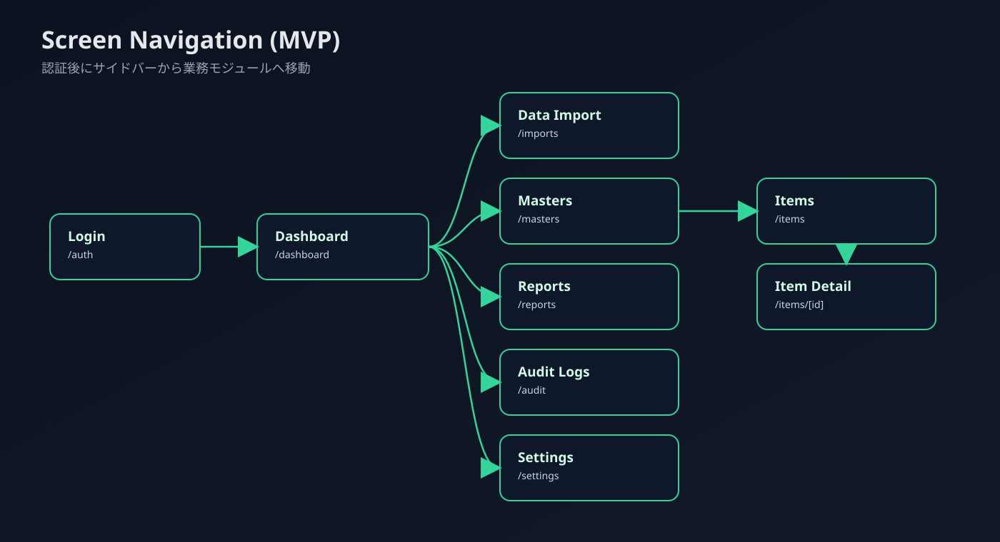
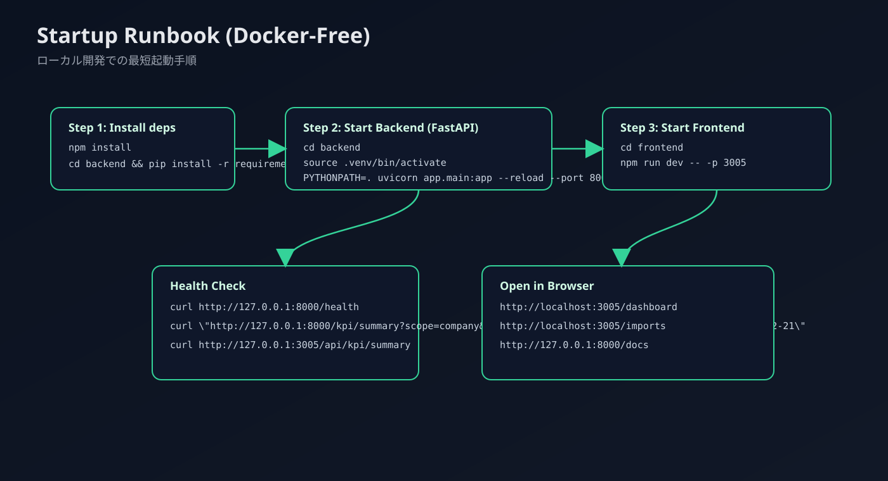

# SalonOps Hub

SalonOps Hub は、直営/FCを含む複数店舗・メーカー/OEM部門のデータを横断統合し、KPI可視化・レポート自動化・監査ログを提供する業務基盤です。

- Frontend: Next.js 14 (App Router) / TypeScript / Tailwind / shadcn/ui style
- Backend: FastAPI / Python
- Auth: NextAuth (Google OAuth + Dev Credentials)
- DB方針: 現在はインメモリ実装（API抽象化済み）、将来 PostgreSQL へ段階移行

## 1) 全体像


## 2) 画面遷移（MVP）



## 3) 起動Runbook（Dockerなし）



## 4) クイックスタート（Mac）

### 4-1. 初期セットアップ

```bash
cd "/Users/ayumuyoshinaga/Desktop/SalonOps Hub"

cp .env.example .env
cp frontend/.env.example frontend/.env.local
cp backend/.env.example backend/.env

npm install

cd backend
python3 -m venv .venv
source .venv/bin/activate
pip install -r requirements.txt
cd ..
```

### 4-2. 起動（推奨: フロント3005 / バック8000）

#### ターミナル1: Backend

```bash
cd "/Users/ayumuyoshinaga/Desktop/SalonOps Hub/backend"
source .venv/bin/activate
PYTHONPATH=. uvicorn app.main:app --reload --host 127.0.0.1 --port 8000
```

#### ターミナル2: Frontend

```bash
cd "/Users/ayumuyoshinaga/Desktop/SalonOps Hub/frontend"
npm run dev -- -p 3005
```

### 4-3. 疎通確認

```bash
curl -sS http://127.0.0.1:8000/health
curl -sS "http://127.0.0.1:8000/kpi/summary?scope=company&period=monthly&from_date=2026-02-01&to_date=2026-02-21"
curl -sS "http://127.0.0.1:3005/api/kpi/summary?scope=company&period=monthly&from=2026-02-01&to=2026-02-21"
```

ブラウザ:
- `http://localhost:3005/auth`
- `http://localhost:3005/dashboard`
- `http://localhost:3005/imports`
- `http://127.0.0.1:8000/docs`

## 5) いまいる場所別コマンド

### 5-1. ルート (`SalonOps Hub/`) にいる場合

```bash
# frontend (3000)
npm run dev:frontend

# backend (8000)
npm run dev:backend
```

### 5-2. `frontend/` にいる場合

```bash
# 正しい
npm run dev

# 3005で起動
npm run dev -- -p 3005
```

```bash
# 誤り（frontend/frontend/package.json を探して失敗する）
npm --prefix frontend run dev
```

### 5-3. `backend/` にいる場合

```bash
source .venv/bin/activate
PYTHONPATH=. uvicorn app.main:app --reload --host 127.0.0.1 --port 8000
```

## 6) テスト

```bash
# 全体
cd "/Users/ayumuyoshinaga/Desktop/SalonOps Hub"
npm run test

# frontendのみ
npm --prefix frontend run test

# backendのみ
cd backend
source .venv/bin/activate
PYTHONPATH=. pytest
```

## 7) よくあるエラー

### `EADDRINUSE: address already in use`

原因: 既に同じポートで別プロセスが起動中です。  
対応: ポートを変更して起動します。

```bash
# frontend
npm run dev -- -p 3005

# backend
PYTHONPATH=. uvicorn app.main:app --reload --host 127.0.0.1 --port 8001
```

### `ENOENT ... frontend/frontend/package.json`

原因: `frontend` ディレクトリ内で `--prefix frontend` を付けて実行しているためです。  
対応: `frontend` 内では `npm run dev` を使ってください。

## 8) 主要機能（MVP）

- KPIダッシュボード（店舗/事業/全社、期間切替、前年差/前月差、異常表示）
- CSV取込（必須・型・範囲・重複チェック、原因+修正方法のエラー表示）
- マスタ管理（店舗/KPI定義）
- レポート生成・再送（Server Action + API）
- 監査ログ検索（誰がいつ何を変更したか）
- Items管理（検索 + バルク更新 + 詳細履歴）

## 9) リポジトリ構成

```text
SalonOps Hub/
├── backend/
│   ├── app/
│   │   ├── main.py
│   │   ├── deps.py
│   │   ├── repository.py
│   │   ├── schemas.py
│   │   ├── services.py
│   │   └── routers/
│   ├── tests/
│   ├── requirements.txt
│   └── .env.example
├── frontend/
│   ├── app/
│   ├── components/
│   ├── lib/
│   ├── package.json
│   └── .env.example
├── docs/
│   ├── images/
│   │   ├── system-architecture.svg
│   │   ├── screen-flow.svg
│   │   └── runbook-flow.svg
│   ├── architecture.md
│   ├── openapi.yaml
│   ├── operations.md
│   └── ui-ux-patterns.md
├── package.json
└── .env.example
```

## 10) 補足ドキュメント

- 画面遷移・ER図: `docs/architecture.md`
- OpenAPI概要: `docs/openapi.yaml`
- 運用手順: `docs/operations.md`
- UI/UX設計カタログ: `docs/ui-ux-patterns.md`
