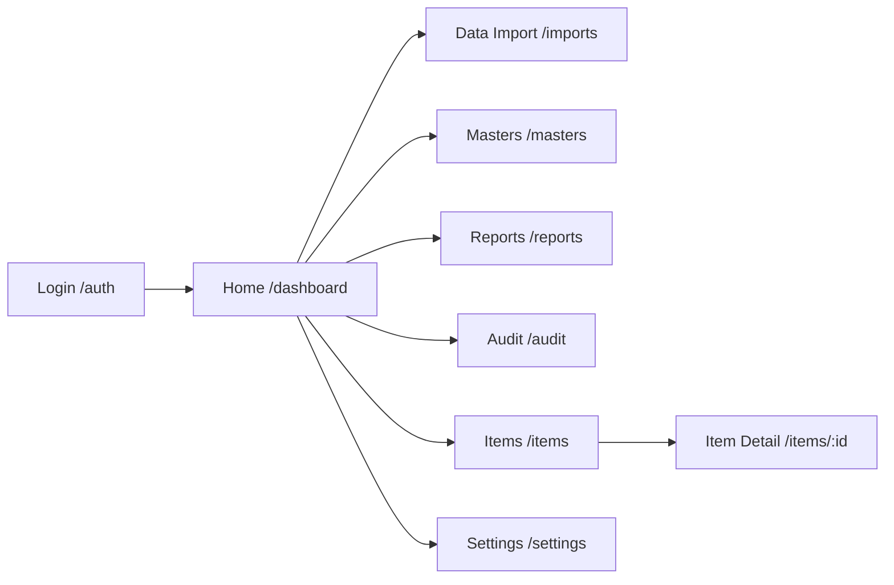
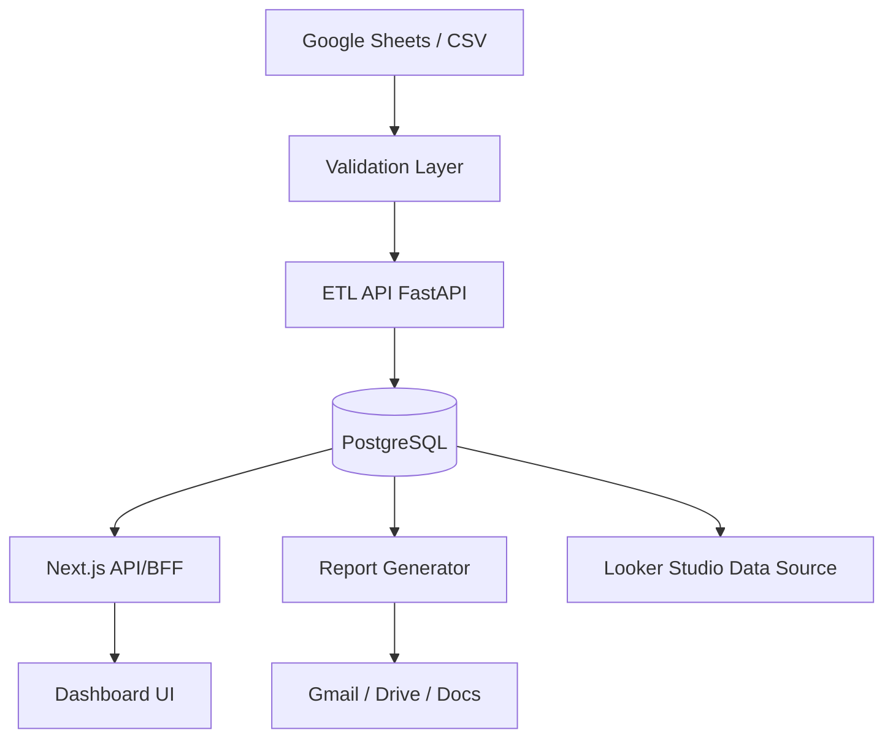
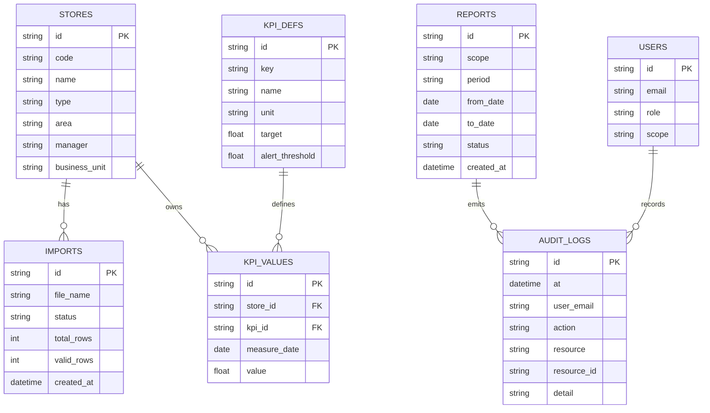

# SalonOps Hub Architecture

## 画面遷移図 (Mermaid)

```mermaid
flowchart LR
  A[Login /auth] --> B[Home /dashboard]
  B --> C[Data Import /imports]
  B --> D[Masters /masters]
  B --> E[Reports /reports]
  B --> F[Audit /audit]
  B --> G[Items /items]
  G --> H[Item Detail /items/:id]
  B --> I[Settings /settings]
```

## データフロー

```mermaid
flowchart TD
  S[Google Sheets / CSV] --> V[Validation Layer]
  V --> ETL[ETL API FastAPI]
  ETL --> DB[(PostgreSQL)]
  DB --> N[Next.js API/BFF]
  N --> UI[Dashboard UI]
  DB --> R[Report Generator]
  R --> M[Gmail / Drive / Docs]
  DB --> L[Looker Studio Data Source]
```

## ER図 (MVP)

```mermaid
erDiagram
  STORES ||--o{ IMPORTS : has
  STORES ||--o{ KPI_VALUES : owns
  KPI_DEFS ||--o{ KPI_VALUES : defines
  REPORTS ||--o{ AUDIT_LOGS : emits
  USERS ||--o{ AUDIT_LOGS : records

  STORES {
    string id PK
    string code
    string name
    string type
    string area
    string manager
    string business_unit
  }

  KPI_DEFS {
    string id PK
    string key
    string name
    string unit
    float target
    float alert_threshold
  }

  IMPORTS {
    string id PK
    string file_name
    string status
    int total_rows
    int valid_rows
    datetime created_at
  }

  KPI_VALUES {
    string id PK
    string store_id FK
    string kpi_id FK
    date measure_date
    float value
  }

  REPORTS {
    string id PK
    string scope
    string period
    date from_date
    date to_date
    string status
    datetime created_at
  }

  AUDIT_LOGS {
    string id PK
    datetime at
    string user_email
    string action
    string resource
    string resource_id
    string detail
  }

  USERS {
    string id PK
    string email
    string role
    string scope
  }
```
